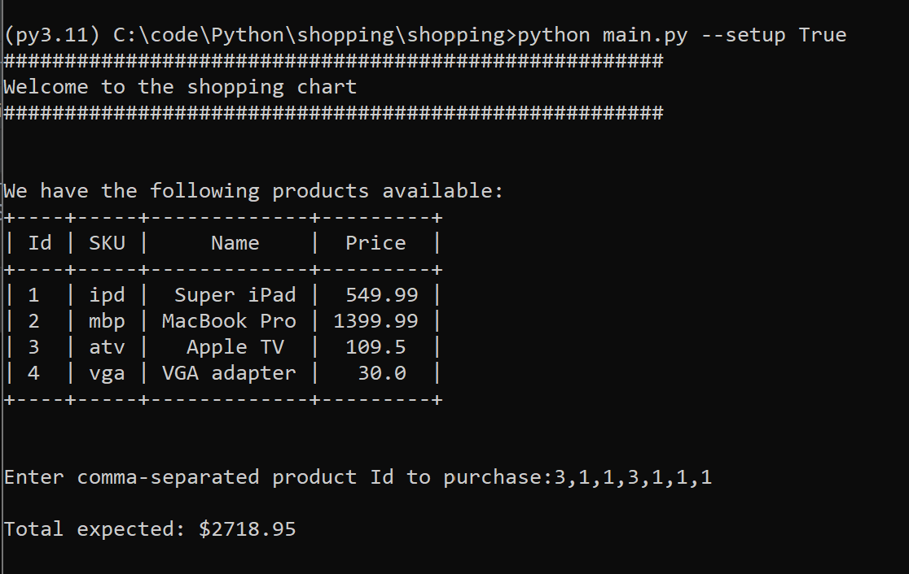
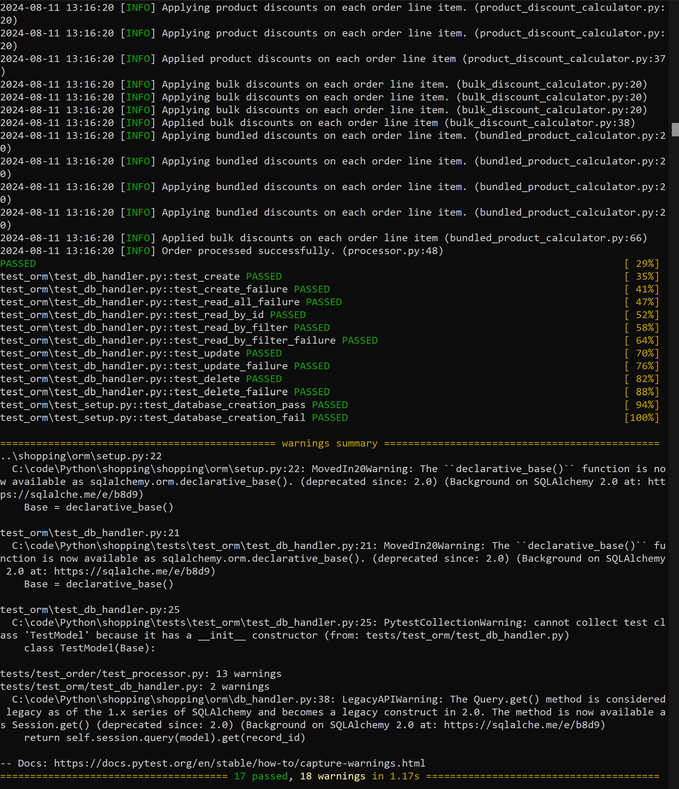

# Checkout Command Line Application

## Table of Contents

- [Local Setup](#local-setup)
- [Command line arguments](#command-line-arguments)
- [Run Test](#run-test)


## Local Setup
1. Clone the repository.
2. Setup a virtual environment. Using Conda, from the repository root run the following:
    - ```shell
      conda create -n py3.11 python=3.11
      ```
    - ```shell
      conda activate py3.11
      ```
    - ```shell
      pip install -r requirements.txt
      ```
3. Add repository root to the PYTHONPATH, from windows command line terminal:
```shell
set PYTHONPATH=%PYTHONPATH%;<PATH_TO_THE_REPOSITORY_ROOT>
```
4. Repository is equipped with pre-commits. For more [click here](https://pre-commit.com/).


## Command line arguments
`main.py` supports the following command line arguments:

1. `--setup`: Is a **optional** boolean argument. To setup the initial database.
2. `--run_mode`: Is an **optional** integer argument. Defines the run mode for the application. Defaults to `production
   mode`. A list of acceptable values are as follows:
    - `0`: Specifies to run the application in the debugging mode.
    - `1`: (Default) Specifies to run the application in the production mode.

3. `--update`: Is an **optional** boolean argument. Gives an ability to update the underlying data easily. Assessment
   brief only tell to that the rules should be flexible.
    Add workflow to update the rules, add products and more.

Example to run the application for the first time (to do the initial setup):
```
python main.py --setup True
```

Example to run the application for the subsequent runs:
```
python main.py
```

Example to run the application in debug mode:
```
python main.py --setup True --run_mode 0
```

Sample Output


## Run Test

1. From repository root, run the following commands to run all the tests:
```shell
cd tests
```
```shell  # This will invoke the entire testing suite
pytest
```


Sample Output

